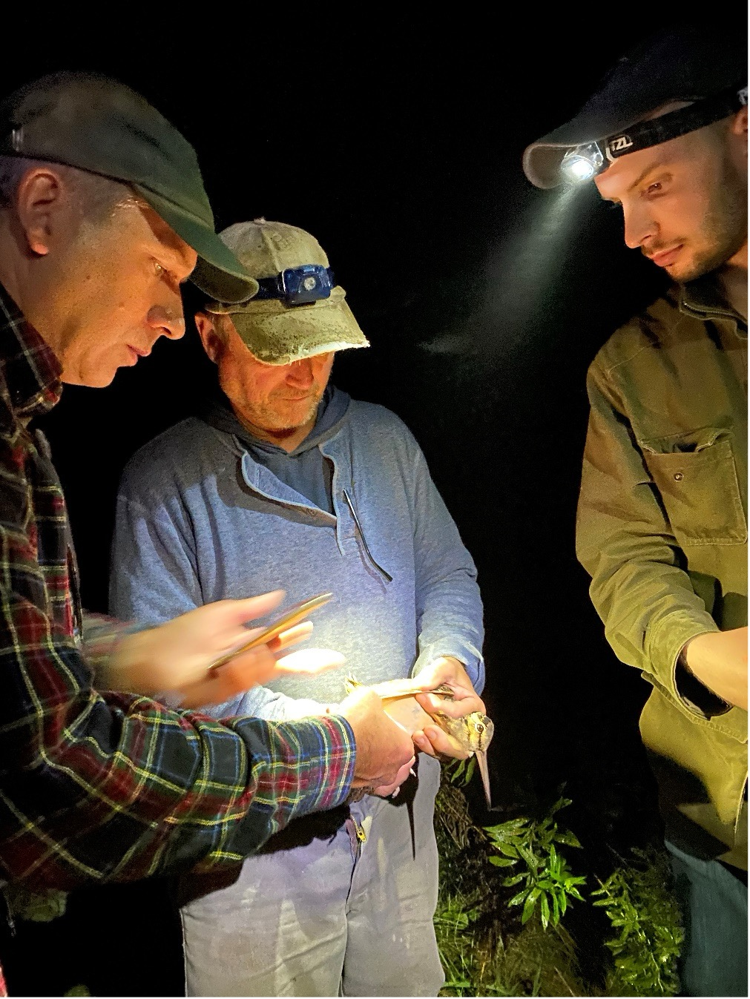
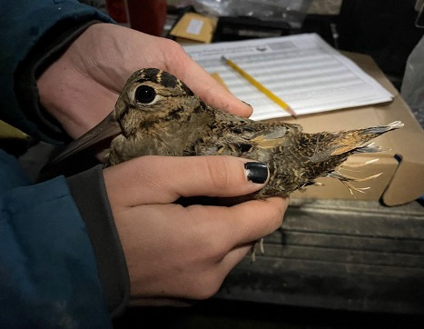
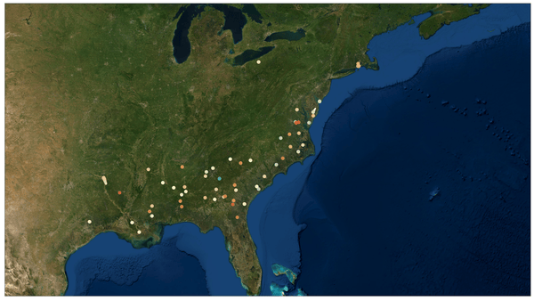

<style> h1.title {display: none;}</style>

<br>
<div class = row>
<div class = "col-md-4 col-sm-4 col-xs-4">
```{r, echo=FALSE, fig.show='hold', fig.align='center'}
knitr::include_graphics("images/headshot_CO_circle.png")
```
</div>
<div class = col-md-8>

The Berigan Lab at Auburn University's [College of Forestry, Wildlife and Environment](https://cfwe.auburn.edu) studies the movements, habitat use, and population dynamics of wildlife. Much of our research focuses on the wintering ecology of birds, especially those reliant on grasslands or frequent disturbance regimes. Many of our projects also use advanced quantitative techniques, seeking new ways to apply these tools to common problems in ornithology and wildlife management.

We're currently starting several new graduate/post-graduate research projects, including 1) an evaluation of grassland restoration practices in Alabama's Black Belt Prairie; 2) development of tools for modeling Motus data and facilitating growth of the network; and 3) examining umbrella species concepts using automated radio telemetry. Some of these positions are currently hiring: consider [joining us](opportunities.html)!

**Research news:**

[Nov. 27, 2025: New $17.5-million initiative aims to restore Black Belt Prairie](https://www.al.com/news/montgomery/2025/11/new-175-million-initiative-aims-to-restore-alabama-black-belt-prairie-good-for-land-and-people.html)

</div>
</div>

<hr />

<div class = "col-md-6">
<div class = "row hidden-xs hidden-sm">
<center>
{width=85%}
</center>
<br>
</div>
</div>
<div class = "col-md-6">
<div class = "row-md-6 hidden-xs hidden-sm">
<center>
{width=72.5%}
</center>
</div>
<div class = "row-md-6">
<br>
<center>

</center>
</div>
</div>

<br>

