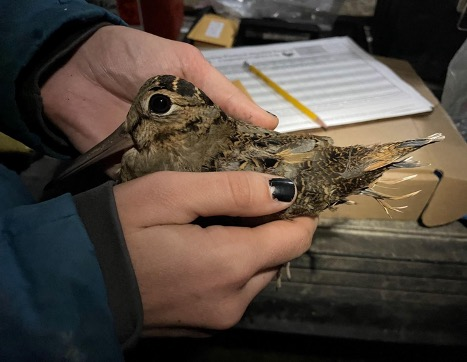
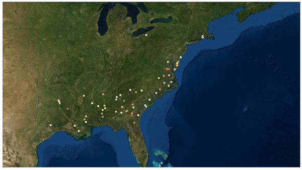

<style> h1.title {display: none;}</style>

<br>
<div class = row>
<div class = "col-md-4 col-sm-4 col-xs-4">
```{r, echo=FALSE, fig.show='hold', fig.align='center'}
knitr::include_graphics("images/headshot_CO_circle.png")
```
</div>
<div class = col-md-8>
I am currently a postdoctoral researcher at [Kansas State University](https://www.k-state.edu) in the [Kansas Cooperative Fish and Wildlife Research Unit](https://www.k-state.edu/kscfwru/). My work focuses on the movements, habitat use, and population dynamics of wildlife, especially bird species. I have particular interests in migration and conservation of at-risk species through techniques such as translocation.

I am also passionate about effective communication of results and scientific recommendations to wildlife agencies and the public. Some of my recent work has used [Shiny](https://www.shinyapps.io/) applications as an interactive platform to allow stakeholders to access data and results. I've included a gallery of those applications [here](applications.html).

My CV is available [here](files/Liam_Berigan_CV.pdf), and I can be contacted via email <a href="mailto: liamaberigan@gmail.com" target="_blank">here</a>.

**Looking for our woodcock habitat prioritization tool (W-PAST)? Click [here](https://woodcock.shinyapps.io/W-PAST).**

</div>
</div>

<hr />

<div class = "col-md-6">
<div class = "row hidden-xs hidden-sm">
<center>
{width=85%}
</center>
<br>
</div>
</div>
<div class = "col-md-6">
<div class = "row-md-6 hidden-xs hidden-sm">
<center>
{width=72.5%}
</center>
</div>
<div class = "row-md-6">
<br>
<center>

</center>
</div>
</div>

<br>

