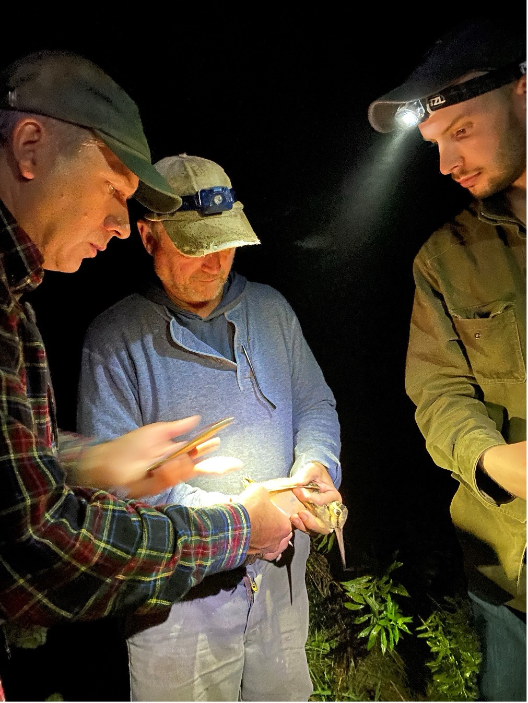

<style> h1.title {display: none;}</style>

<br>
<div class = row>
<div class = "col-md-4 col-sm-4 col-xs-4">
```{r, echo=FALSE, fig.show='hold', fig.align='center'}
knitr::include_graphics("images/headshot_CO_circle.png")
```
</div>
<div class = col-md-8>
I am an Assistant Professor of Quantitative Ecology at [Auburn University](https://www.auburn.edu), where I study the movements, habitat use, and population dynamics of wildlife. I am particularly interested in the wintering ecology of birds, especially those reliant on grasslands or early-successional vegetation. Some of my past work includes [monitoring lesser prairie-chicken translocations](files/Berigan_LPCDispersal_2024.pdf), [building interactive habitat conservation tools](https://woodcock.shinyapps.io/W-PAST), and [modeling woodcock flight altitudes](files/Berigan_flight_altitudes_2025.pdf).

In addition to my research, I also provide statistical consulting within the College of Forestry, Wildlife, and Environment, and teach several courses on statistics and ecology.

My CV is available [here](files/Liam_Berigan_CV.pdf), and I can be contacted via email <a href="mailto: lib0016@auburn.edu" target="_blank">here</a>.

</div>
</div>

<hr />

<div class = "col-md-6">
<div class = "row hidden-xs hidden-sm">
<center>
{width=85%}
</center>
<br>
</div>
</div>
<div class = "col-md-6">
<div class = "row-md-6 hidden-xs hidden-sm">
<center>
{width=72.5%}
</center>
</div>
<div class = "row-md-6">
<br>
<center>

</center>
</div>
</div>

<br>

