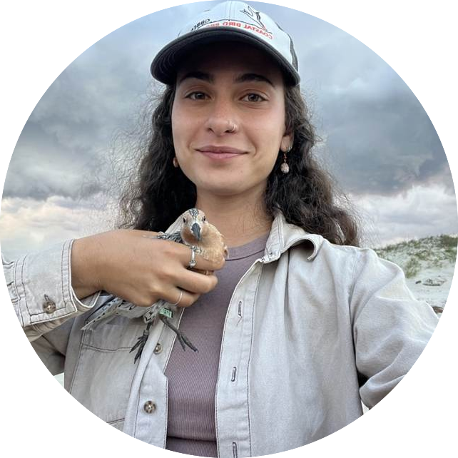
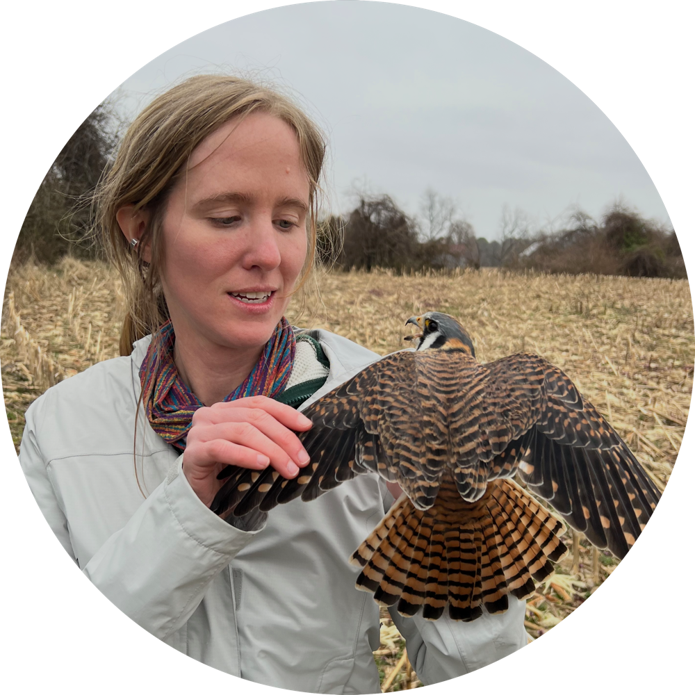

## Primary investigator

 

Dr. Liam Berigan is an Assistant Professor of Quantitative Ecology at [Auburn University](https://www.auburn.edu). He specializes in avian and movement ecology, with a particular focus on questions with immediate implications for conservation and management. Some of his past work includes [monitoring lesser prairie-chicken translocations](files/Berigan_LPCDispersal_2024.pdf), [building interactive habitat conservation tools](https://woodcock.shinyapps.io/W-PAST), and [modeling woodcock flight altitudes](files/Berigan_flight_altitudes_2025.pdf).

In addition to his research, he also provides statistical consulting within the College of Forestry, Wildlife and Environment, and teaches several courses on statistics and ecology.

Email: [lib0016@auburn.edu](mailto:lib0016@auburn.edu)

<!-- 
 -->

<!-- ## Postdocs -->

<!--   -->
<!-- 
 -->
<!-- 
 -->

<!-- 
 -->
<!--  -->
<!-- 
 -->
<!-- 
 -->

<!-- 
 -->

<!-- 
 -->

<!-- Hannah Wright, currently a doctoral student at the University of Georgia, will be joining us as a postdoc in Spring 2027. Her research will focus on the development of tools for modeling Motus data and facilitating growth of the network. -->

<!-- 
 -->
<!-- 
 -->
<!-- 
 -->

## Graduate students

 

Rachel is a New York native and earned her B.S. in Environmental Biology at SUNY ESF in 2022. Following her passion for applied conservation projects, she has worked with a host of imperiled birds including Florida grasshopper sparrows, Hawai’ian honeycreepers, and various shorebirds from the coastal Southeast to the Pacific Northwest and Farallon Islands. Rachel is excited to begin her MS project investigating avian response to grassland restoration in Alabama’s Black Belt Prairie. In her free time, Rachel enjoys reading, photography, playing board games, and spending as much time outside as possible hiking, camping, and birding. *Rachel will start her degree in Spring 2027.*

## Friends of the lab

 

Meredith Lewis is currently a PhD Candidate at the University of Delaware where she studies migration ecology across scales using a combination of weather surveillance radar and automated recording units. Her broad research interests encompass bird migration, community ecology, and avian ecology and conservation throughout the annual cycle. Previously she investigated rail migration using the Motus Wildlife Tracking System and she continues to contribute to bird research in the mid-Atlantic. An experienced bird bander across diverse avian taxa, Meredith has helped lead multiple banding operations and contributed to bander education on passerine molt and aging. Meredith helps manage banding permits for the lab and is a frequent collaborator on field projects.

Email: [merlewis@udel.edu](mailto:merlewis@udel.edu)

