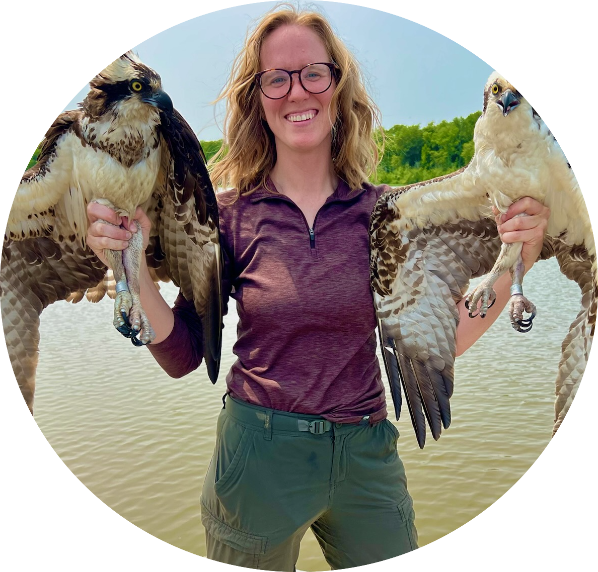

## Primary investigator

 

Dr. Liam Berigan is an Assistant Professor of Quantitative Ecology at [Auburn University](https://www.auburn.edu). He specializes in avian and movement ecology, with a particular focus on questions with immediate implications for conservation and management. Some of his past work includes [monitoring lesser prairie-chicken translocations](files/Berigan_LPCDispersal_2024.pdf), [building interactive habitat conservation tools](https://woodcock.shinyapps.io/W-PAST), and [modeling woodcock flight altitudes](files/Berigan_flight_altitudes_2025.pdf).

In addition to his research, he also provides statistical consulting within the College of Forestry, Wildlife and Environment, and teaches several courses on statistics and ecology.

Email: [lib0016@auburn.edu](mailto:lib0016@auburn.edu)

<!-- 
 -->

<!-- ## Postdocs -->

<!--   -->
<!-- 
 -->
<!-- 
 -->

<!-- 
 -->
<!--  -->
<!-- 
 -->
<!-- 
 -->

<!-- 
 -->

<!-- 
 -->

<!-- Hannah Wright, currently a doctoral student at the University of Georgia, will be joining us as a postdoc in Spring 2027. Her research will focus on the development of tools for modeling Motus data and facilitating growth of the network. -->

<!-- 
 -->
<!-- 
 -->
<!-- 
 -->

## Graduate students

 

Rachel Brodman will be joining us as a M.S. student in Spring 2027. Her research will focus on an evaluation of grassland restoration practices in Alabama's Black Belt Prairie.

## Friends of the lab

 

Meredith Lewis is a doctoral candidate at the University of Delaware, where she researches migratory ecology using radar and automated recording units. She is also a prolific bird bander, having banded thousands of birds among dozens of taxa. She manages federal bird banding permits for the lab, and is a frequent collaborator on field research projects.

Email: [merlewis@udel.edu](mailto:merlewis@udel.edu)

