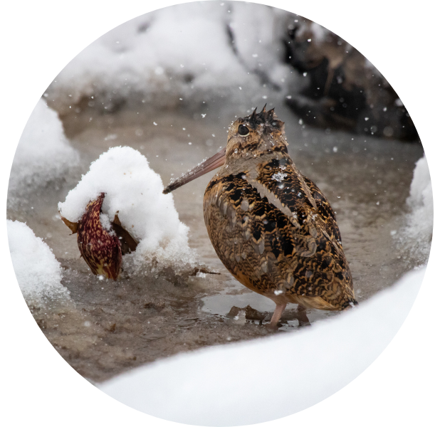
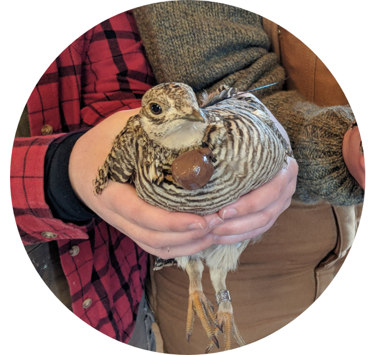
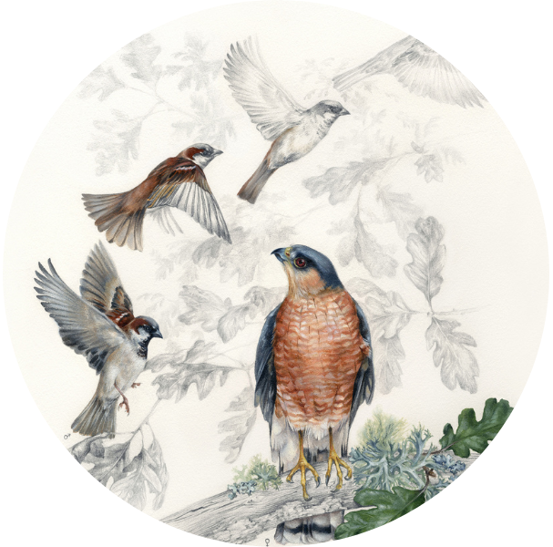

## Population dynamics and occupancy
 

Population dynamics are often limited by the presence/absence of certain features on a landscape; the identification of those features can substantially aid in management for that species. During my postdoc at [K-State](https://www.k-state.edu), I have been attempting to identify limiting factors in lesser prairie-chicken occupancy and within-lek population dynamics. Our results indicate that U.S. Department of Agriculture Conservation Reserve Program Grasslands (CRP) have an outsized role in sustaining lesser prairie-chicken lek abundance throughout the Kansas portion of their range. Lesser prairie-chicken population trends are likely to be closely linked to future CRP enrollment, and particularly to program allocation/rental rate decisions made in the next Farm Bill.

We currently have a draft manuscript based on the first portion of this analysis, which is under consideration at *Conservation Biology*. We are also working on two additional analyses using this dataset:

1. Developing novel methods for fitting density-dependence models with covariates in a Bayesian hierarchical framework. 

2. Examining habitat connectivity for lesser prairie-chickens at multiple spatial scales using clustering analyses.

## Movement & habitat ecology
 

Recent focus on migratory bird declines have led to increased interest in how birds move and use habitat throughout their full annual cycle. The [Eastern Woodcock Migration Research Cooperative (EWMRC)](https://www.woodcockmigration.org) has been examining migratory bird movement ecology and habitat selection using migratory data from >700 GPS-tagged American Woodcock, tagged with the assistance of 44+ federal, state, and non-profit collaborators during all seasons and throughout eastern North America. 

My doctoral dissertation used this dataset to meet 4 objectives :

1. Development of a management prioritization tool for the Pennsylvania Game Commission, titled [W-PAST](https://woodcock.shinyapps.io/W-PAST).

2. Creation of a classification system which uses modified hidden Markov models to estimate migratory states from sparse GPS data.

3. Assessment of how functional responses impact the habitat use of migratory birds throughout the full annual cycle.

4. Examination of woodcock migratory altitudes and woodcocks' comparative exposure to airspace obstacles during migratory flights.

 

*Publications:*

**Berigan, L. A.**, S. J. Clements, R. L. Darling, A. C. Fish, A. M. Roth, G. Balkcom, ... and E. J. Blomberg (2025). Low migratory flight altitudes may explain increased collision risk for *Scolopax minor* (American Woodcock). Ornithological Applications 127:duaf017. [PDF](files/Berigan_flight_altitudes_2025.pdf)

Slezak, C. R., E. J. Blomberg, A. M. Roth, **L. A. Berigan**, A. C. Fish, R. L. Darling, ... and S. R. McWilliams (2024). Unconventional life history in a migratory shorebird: desegregating reproduction and migration. Proceedings of the Royal Society B 291:20240021. [PDF](files/Slezak_itinerant_2024.pdf)

**Berigan, L. A.** (2024). Full annual cycle analysis of American Woodcock (*Scolopax minor*) distribution, habitat use, and migration ecology. PhD dissertation, University of Maine. [PDF](files/Berigan_PhD_dissertation.pdf)

Clements, S. J., **L. A. Berigan**, A. C. Fish, R. L. Darling, A. M. Roth, G. Balkcom, ... and E. J. Blomberg (2024). Satellite tracking of American Woodcock reveals a gradient of migration strategies. Ornithology 141:ukae008. [PDF](files/Clements_strategies_2024.pdf)

Fish, A. C., A. M. Roth, G. Balkcom, **L. A. Berigan**, K. L. Darling, S. J. Clements, ... and E. J. Blomberg (2024). American woodcock migration phenology in eastern North America: implications for hunting season timing. Journal of Wildlife Management e22565. [PDF](files/Fish_phenology_2024.pdf)

Blomberg E. J., A. C. Fish, **L. A. Berigan**, A. M. Roth, R. Rau, S. J. Clements, ... and  L. Williams (2023). The American woodcock singing ground survey largely conforms to the phenology of male woodcock migration. Journal of Wildlife Management 87(8):e22488. [PDF](files/Blomberg_SGS_2023.pdf)

*Popular science presentations:* [Harris Center](https://www.youtube.com/watch?v=ivrPYA-CgBI&ab_channel=HarrisCenter), [Friends of Mississquoi NWR](https://www.youtube.com/watch?v=PAqzFuZ15Mo&ab_channel=FriendsofMissisquoi)

## Reintroducing at-risk species
 

Lesser prairie-chickens have recently been listed under the U.S. Endangered Species Act due to widespread declines throughout most of their range. To combat these declines, a collaborative federal, state, and university effort translocated 411 lesser prairie-chickens to unoccupied areas of presumed habitat in the Sand Sagebrush Prairie Ecoregion. During the translocation, we conducted an assessment of lesser prairie-chicken habitat requirements in areas where birds were released (especially the [Cimarron](https://www.fs.usda.gov/recarea/psicc/recarea/?recid=12404) and [Comanche](https://www.fs.usda.gov/detail/psicc/about-forest/districts/?cid=fsm9_032695) National Grasslands) and found that areas of Sand Sagebrush prairie which had formerly hosted lesser prairie-chickens no longer contained sufficient nesting habitat for their persistence.
 
 
We also found that lesser prairie-chicken dispersal after translocation was almost universal, and resulted in the diffusion of the translocated population across an area totalling nearly 4,000 square kilometers (~1.25x the size of Rhode Island). Our paper describing this dispersal, published in Ecology and Evolution in 2024, advises that practitioners carefully evaluate the role of translocation before they use it for the restoration of this iconic prairie species.
 
 

*Publications:*

**Berigan, L. A.**, C. S. Aulicky, E. C. Teige, D. S. Sullins,  K. A. Fricke, J. H. Reitz, ... and D. A. Haukos (2024). Lesser prairie-chicken dispersal after translocation: Implications for restoration and population connectivity. Ecology and Evolution 14(2):e10871. [PDF](files/Berigan_LPCDispersal_2024.pdf)

Teige, E. C., **L. A. Berigan**, C. S. Aulicky, J. H. Reitz, D. A. Haukos, D. S. Sullins, ... and L. G. Rossi. Assessment of lesser prairie‐chicken translocation through survival and lek surveys. Wildlife Society Bulletin 47(4):e1493. [PDF](files/Teige_survival_2023.pdf)

**Berigan, L. A.**, C. S. Aulicky, E. C. Teige, D. S. Sullins, D. A. Haukos, K. A. Fricke, ... and A. M. Ricketts (2022). Availability of lesser prairie‐chicken nesting habitat impairs restoration success. Wildlife Society Bulletin 46(5):e1379. [PDF](files/Berigan_LPCHabitat_2022.pdf)

**Berigan, L. A.** (2019). Dispersal, reproductive success, and habitat use by translocated lesser prairie-chickens. Master's thesis, Kansas State University. [PDF](files/Berigan_MastersThesis.pdf)

*Use in listing decisions:* [Federal Register 87(226), page 72739](files/Federal_Register_2022_listing.pdf)

*Media:* <a href="https://www.cbsnews.com/colorado/news/lesser-prairie-chickens-kansas-colorado-grasslands/" target="_blank">CBS News</a>, <a href="https://www.denverpost.com/2022/12/08/prairie-chicken-endangered-rescue-colorado/" target="_blank">Denver Post</a>, <a href="https://boulderweekly.com/news/midnight-on-the-prairie/" target="_blank">Boulder Weekly</a>, <a href="https://coloradooutdoorsmag.com/2020/07/27/conservation-update-lesser-prairie-chickens/" target="_blank">Colorado Outdoors Magazine</a>, <a href="https://northfortynews.com/category/news/four-year-project-sees-hundreds-of-lesser-prairie-chickens-reintroduced/" target="_blank">North Forty News</a>

## Urban bird declines 
 

[Nearly 3 billion birds](https://www.birds.cornell.edu/home/bring-birds-back/) have disappeared from North America since 1970, in large part due to massive declines in abundance among common bird species. Our team used citizen science data collected by [Project Feederwatch](https://feederwatch.org/) to measure trends in House Sparrow abundance and evaluate potential reasons for their disappearance. We found that House Sparrow declines were closely linked to highly-urbanized landscapes, and did not appear to be related to the resurgence in *Accipiter* hawk populations that contributed to declines in Europe. The cause of House Sparrow declines in North America is likely tightly linked to urban landscapes, and may include the modification of urban greenspaces or feral cat populations. Our results were published in the Wilson Journal of Ornithology in 2020.
 
 

*Publication:*

**Berigan, L. A.**, E. I. Greig, and D. N. Bonter (2020). Urban House Sparrow (*Passer domesticus*) populations decline in North America. The Wilson Journal of Ornithology 132(2):248-258. [PDF](files/Berigan_HouseSparrow_2020.pdf)

*Media:* [ScienceDaily](https://www.sciencedaily.com/releases/2021/02/210211114002.htm), [New York Almanac](https://www.newyorkalmanack.com/2021/02/even-the-common-house-sparrow-is-in-decline-study-finds/), [Grand Forks Herald](https://www.grandforksherald.com/sports/northland-outdoors/always-in-season-mike-jacobs-house-sparrow-numbers-continue-long-term-decline)

