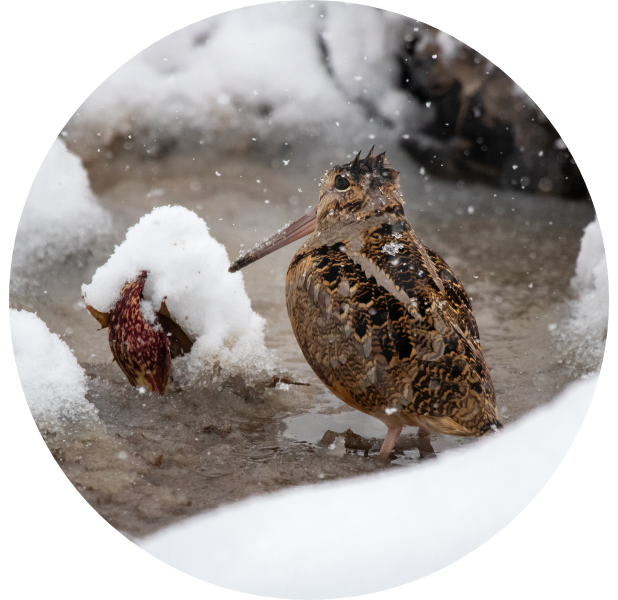

## Restoration of southeastern prairies
 

Prairies in the southeastern U.S. are considered some of the most endangered ecosystems in North America, with >90% of southeastern prairies being lost over the last 300 years. This has led to declines in wintering grassland bird populations, and range contractions for at-risk species such as Henslow's Sparrow and LeConte's Sparrow. The [Black Belt Prairie Initiative](https://alabamasoilandwater.gov/blackbelt/), administered by the Alabama Soil & Water Conservation Committee (ASWCC), aims to help landowners restore prairies with native plant compositions throughout Alabama's Black Belt region. We're assisting ASWCC by evaluating the efficacy of prairie restoration practices at bringing back grassland birds, and measuring how the patch size of restored prairie affects the resulting avian communities. This project is being led by incoming M.S. student Rachel Brodman.

## Woodcock ecology in the wintering range
 

American Woodcock populations have been declining throughout their range since at least the 1980s, presumably due to habitat loss in the breeding, wintering, and migratory ranges. However, most of the research on restoring woodcock populations has been focused on the breeding range, with very little attention paid to wintering habitat. We're collaborating with the [Eastern Woodcock Migration Research Cooperative (EWMRC)](https://www.woodcockmigration.org) to expand woodcock research in the southeastern United States, particularly focusing on habitat management and distribution modeling. Most of our research involves GPS-tagging woodcock; to date, the EWMRC has tagged 700+ birds throughout eastern North America, which allows us examine questions about woodcock habitat use, movement, and survival at a range-wide scale.

*Several new projects are upcoming, and will be added shortly. Watch this space...*

