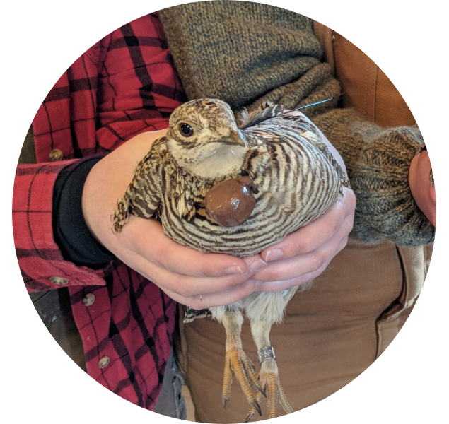
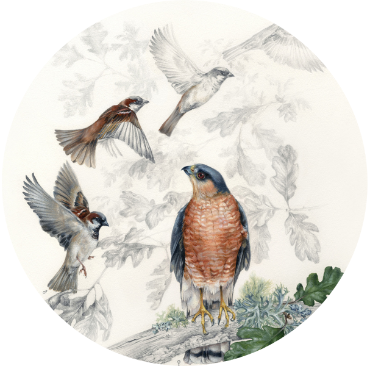

<hr />
## Quantitative skills
<br>
<div class = row>
<div class = col-md-4>
<center>

</center>
</div>

<div class = col-md-8>
Much of my experience teaching quantitative skills comes through a lecture/lab hybrid format, where students receive a common introduction to concepts before breaking out into groups or working individually through a lab assignment. While teaching in this format, I keep the following points in mind:
<br>

Multimodal presentation of content

Interactive use of statistics programs
Excel, R, Shinyapps

Pacing

1. **Equations**: they're a necessary part of any quantitative course, but they're also one of the most common places where students fall behind (even at a collegiate or graduate level). On the bright side, building competence with mathematical formulae can really broaden a student's ability to read scientific literature, and understand the structure of the statistical techniques they're using. I adopt the following techniques to improve student's comfort level with equations:

+ *Text, graphical, and mathematical notation*: Every equation in my course material is accompanied by a detailed definition of every variable (even those that have been introduced before),  a plain-text explanation of how the equation functions, and a graphical demonstration of the equation when appropriate. For example, my course material includes the following description of an exponential growth model:

$$N_{t+1} = N_{t} e^{r}$$

$N_{t}$: Population size in year *t*

$N_{t+1}$: Population size in the next year ($t+1$)

$e$: Mathematical constant referred to as Euler's number (pronounced 'oiler'). Approximatly equal to 2.71828.

$r$: Instantaneous population growth rate: the rate at which new individuals enter a population. When r = 0, no population growth occurs. If r > 0, the population is growing, and if r < 0, the population is shrinking.

The exponential growth model demonstrates how population growth accelerates when the number of individuals in the population increases. Let's use a fairly typical value of r (r = 0.1). At fairly small population sizes ($N_{t}=5$), the population would grow fairly slowly.

$$N_{t}*e^{r}$$
$$(5)*2.71828^{0.1} = 5.53$$

Here, the population increased by only 0.53 individuals. Let's see what happens if we increase $N_{t}$ to a much larger number ($N_{t}=500$).

$$N_{t}*e^{r}$$
$$(500)*2.71828^{0.1} = 553.59$$

Here, the population increased by 53.59 individuals. Remember that $r$ = *birth rate - death rate*: we had 10x more starting individuals in this case, and so we had 10x more reproductive output. Here's a graphical illustration of how a population which starts small might experience exponential growth.

```{r echo=FALSE, fig.height=5, fig.width=5, message=FALSE}
library(tidyverse)
library(ggtext)

pop <- numeric(length = 50)
pop[1] <- 5

for(i in 2:50){
  pop[i] <- pop[i-1]*(2.71828^0.1)
}

example_tbl <- tibble(index = 1:50, pop1 = pop)

example_tbl %>% 
  ggplot(aes(x = index, y = pop1)) +
  geom_line() +
  geom_point(size = 1) +
  labs(x = "Year (*t*)", y = expression("Population size (N<sub>t</sub>)")) +
  theme_bw() +
  theme(axis.title.x = element_markdown(),
        axis.title.y = element_markdown()) +
  scale_x_continuous(limits = c(-10, 62), breaks = c(0, 10, 20, 30, 40, 50)) +
  annotate("text", label = "At small population sizes, \ngrowth is slow", x = 18, y = 450, color = "darkblue") +
  annotate("text", label = "As population size increases, \ngrowth increases rapidly", x = 18, y = 375, color = "darkred") + 
  annotate("text", label = "32 new individuals \nin years 1-20", x = -2, y = 65, size = 3, color = "darkblue") +
  annotate("text", label = "571 new individuals \nin years 31-50", x = 53, y = 70, size = 3, color = "darkred") +
  annotate("errorbar", x = -2, ymin = 0, ymax = 31.94523, width = 2, color = "darkblue") +
  annotate("errorbar", x = 53, ymin = 100.427482, ymax = 671.446685, width = 2, color = "darkred")
```


+ *Excel*: While I tend to shy away from Excel when working on research, I've found it to be an incredibly useful tool for teaching statistics.

<br>
During this project we’ve developed a process for classifying GPS data collected during bird migration, which uses a modified step-length threshold with a hidden Markov model to estimate the migratory state of a woodcock at any point of its full annual cycle. As this technique can be used to estimate the migratory state of a bird during a mortality event, we’ll be able to integrate these classifications into an upcoming paper which examines woodcock survival in respect to migration. We’ve also used woodcock as a model for understanding how functional responses impact the habitat use of migratory birds throughout the year, and as an example of a low-altitude flier when examining how airspace obstacles overlap with migratory flight altitudes.


</div>
</div>
<hr />
## Conservation of at-risk species
<br>
<div class = row>
<div class = col-md-8>
Lesser prairie-chickens have recently been listed under the U.S. Endangered Species Act due to widespread declines throughout most of their range. To combat these declines, a collaborative federal, state, and university effort translocated 411 lesser prairie-chickens to unoccupied areas of presumed habitat in the Sand Sagebrush Prairie Ecoregion. During the translocation, we conducted an assessment of lesser prairie-chicken habitat requirements in areas where birds were released (especially the [Cimarron](https://www.fs.usda.gov/recarea/psicc/recarea/?recid=12404) and [Comanche](https://www.fs.usda.gov/detail/psicc/about-forest/districts/?cid=fsm9_032695) National Grasslands) and found that areas of Sand Sagebrush prairie which had formerly hosted lesser prairie-chickens no longer contained sufficient nesting habitat for their persistence.
<br>
<br>
We also found that lesser prairie-chicken dispersal after translocation was almost universal, and resulted in the diffusion of the translocated population across an area totalling nearly 4,000 square kilometers (~1.25x the size of Rhode Island). Our paper describing this dispersal, published in Ecology and Evolution in 2024, advises that practitioners carefully evaluate the role of translocation before they use it for the restoration of this iconic prairie species.
<br>
<br>

*Publications:*

**Berigan, L. A.**, C. S. Aulicky, E. C. Teige, D. S. Sullins,  K. A. Fricke, J. H. Reitz, ... and D. A. Haukos (2024). Lesser prairie-chicken dispersal after translocation: Implications for restoration and population connectivity. Ecology and Evolution 14(2):e10871. [PDF](files/Berigan_LPCDispersal_2024.pdf)

Teige, E. C., **L. A. Berigan**, C. S. Aulicky, J. H. Reitz, D. A. Haukos, D. S. Sullins, ... and L. G. Rossi. Assessment of lesser prairie‐chicken translocation through survival and lek surveys. Wildlife Society Bulletin 47(4):e1493. [PDF](files/Teige_survival_2023.pdf)

**Berigan, L. A.**, C. S. Aulicky, E. C. Teige, D. S. Sullins, D. A. Haukos, K. A. Fricke, ... and A. M. Ricketts (2022). Availability of lesser prairie‐chicken nesting habitat impairs restoration success. Wildlife Society Bulletin 46(5):e1379. [PDF](files/Berigan_LPCHabitat_2022.pdf)

**Berigan, L. A.** (2019). Dispersal, reproductive success, and habitat use by translocated lesser prairie-chickens. Master's thesis, Kansas State University. [PDF](files/Berigan_MastersThesis.pdf)

*Use in listing decisions:* [Federal Register 87(226), page 72739](files/Federal_Register_2022_listing.pdf)

*Media:* <a href="https://www.cbsnews.com/colorado/news/lesser-prairie-chickens-kansas-colorado-grasslands/" target="_blank">CBS News</a>, <a href="https://www.denverpost.com/2022/12/08/prairie-chicken-endangered-rescue-colorado/" target="_blank">Denver Post</a>, <a href="https://boulderweekly.com/news/midnight-on-the-prairie/" target="_blank">Boulder Weekly</a>, <a href="https://coloradooutdoorsmag.com/2020/07/27/conservation-update-lesser-prairie-chickens/" target="_blank">Colorado Outdoors Magazine</a>, <a href="https://northfortynews.com/category/news/four-year-project-sees-hundreds-of-lesser-prairie-chickens-reintroduced/" target="_blank">North Forty News</a>
</div>
<div class = col-md-4>
<center>

</center>
</div>
</div>
<hr />
## Urban bird declines 
<br>
<div class = row>
<div class = col-md-4>
<center>

</center>
</div>
<div class = col-md-8>
[Nearly 3 billion birds](https://www.birds.cornell.edu/home/bring-birds-back/) have disappeared from North America since 1970, in large part due to massive declines in abundance among common bird species. Our team used citizen science data collected by [Project Feederwatch](https://feederwatch.org/) to measure trends in House Sparrow abundance and evaluate potential reasons for their disappearance. We found that House Sparrow declines were closely linked to highly-urbanized landscapes, and did not appear to be related to the resurgence in *Accipiter* hawk populations that contributed to declines in Europe. The cause of House Sparrow declines in North America is likely tightly linked to urban landscapes, and may include the modification of urban greenspaces or feral cat populations. Our results were published in the Wilson Journal of Ornithology in 2020.
<br>
<br>

*Publication:*

**Berigan, L. A.**, E. I. Greig, and D. N. Bonter (2020). Urban House Sparrow (*Passer domesticus*) populations decline in North America. The Wilson Journal of Ornithology 132(2):248-258. [PDF](files/Berigan_HouseSparrow_2020.pdf)

*Media:* [ScienceDaily](https://www.sciencedaily.com/releases/2021/02/210211114002.htm), [New York Almanac](https://www.newyorkalmanack.com/2021/02/even-the-common-house-sparrow-is-in-decline-study-finds/), [Grand Forks Herald](https://www.grandforksherald.com/sports/northland-outdoors/always-in-season-mike-jacobs-house-sparrow-numbers-continue-long-term-decline)
</div>
</div>


